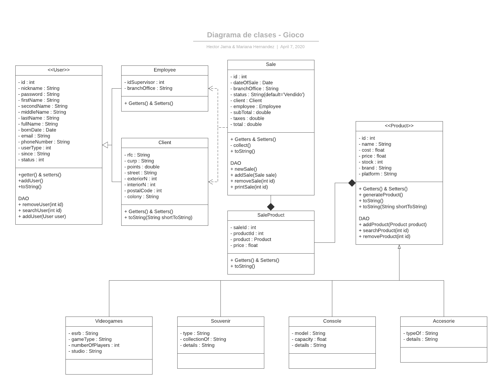

# Gioco - Punto de venta

_Proyecto de la materia de Programación orientada a objetos (OOP), en la cual nos basamos en un caso de estudio para poder elaborar el proyecto._
## Comenzando 🚀

_Nos basamos en el modelo de negocio del gameplanet, sucursal plaza del parque, de la cual fuimos a hacer una entrevista para poder obtener los requerimientos del proyecto._

### Desarrollo 📋

_El proyecto fue elaborado usando el JDK 13, pero corre sin problemas en el JDK 8 (el mas común en el mercado), solo se tiene que cambiar la linea de compilador propia de maven en el archivo "pom.xml".
Una vez seleccionado el JDK a usar, tenemos tenemos que correrlo. Se puede correr desde el IDE, o desde la consola de nuestro sistema operativo:_

```
$java -classpath .\out\artifacts\Console_Gioco_Project_jar\Console-Gioco-Project.jar  Main
```

### IDE 🔧

_Se usó el IDE IntelliJ Idea Ultimate 2019.3 para la elaboracipon del proyecto. Por lo tanto, la estructura del proyecto es tal la de un proyecto de IntelliJ_

_También se hizo uso de maven para el empaquetado e implementación de librerías, puesto que se tenía pensado hacer uso de JUnit Testing para realizar pruebas en el proyecto, pero por motivos de tiempo, no fue posible hacer uso de esta caracteristica._


### Diagrama de clases
Con el tiempo de desarrollo fuimos viendo que el primer diagrama de clases no tomaba en cuenta muchos aspectos que fuimos viendo durante el desarrollo del programa, por lo tanto se le tuvo que llevar a cabo varias modificaciones (En un plano general), pero tambien hay que tomar en cuenta que este diagrama solo toma en cuenta la interacción de los objetos del modelo y no la interacción de todo el sistema.
 
  


---
⌨️ con ❤️ por [Hector Jama](https://github.com/JamaHCS) & [Mariana Hernandez](https://github.com/MarianaHdz)
